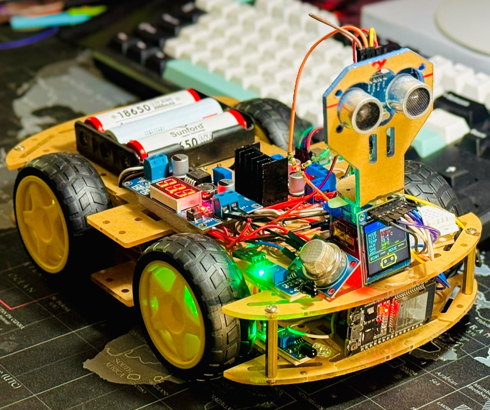
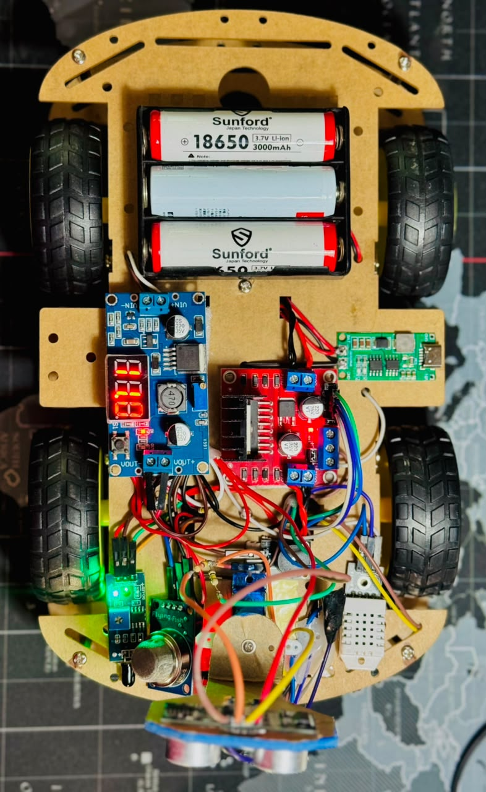
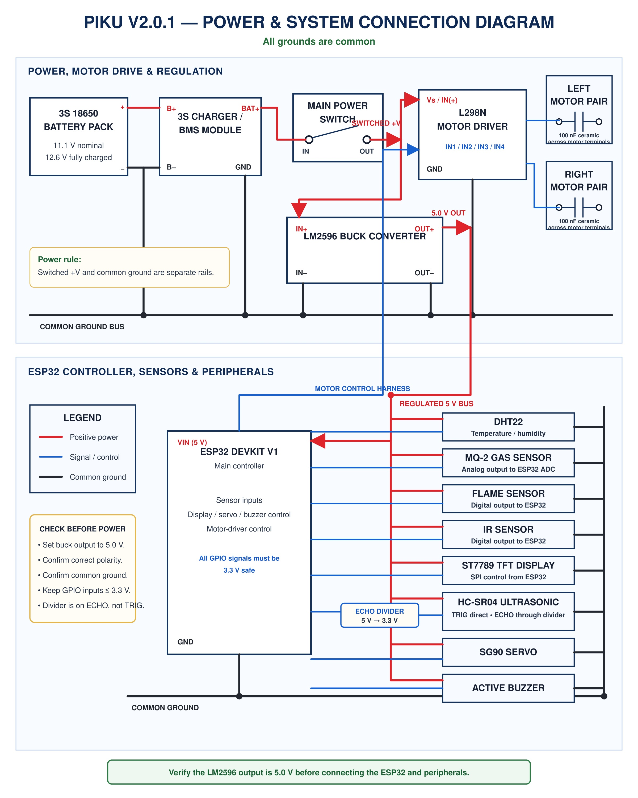
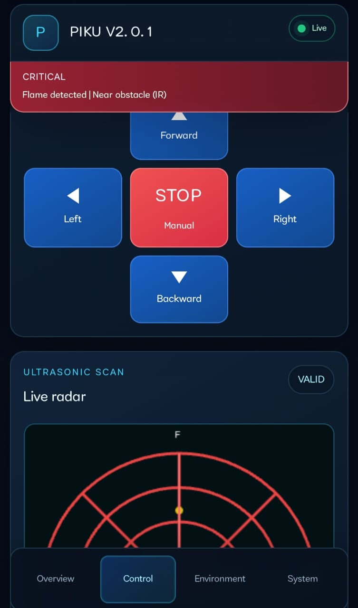
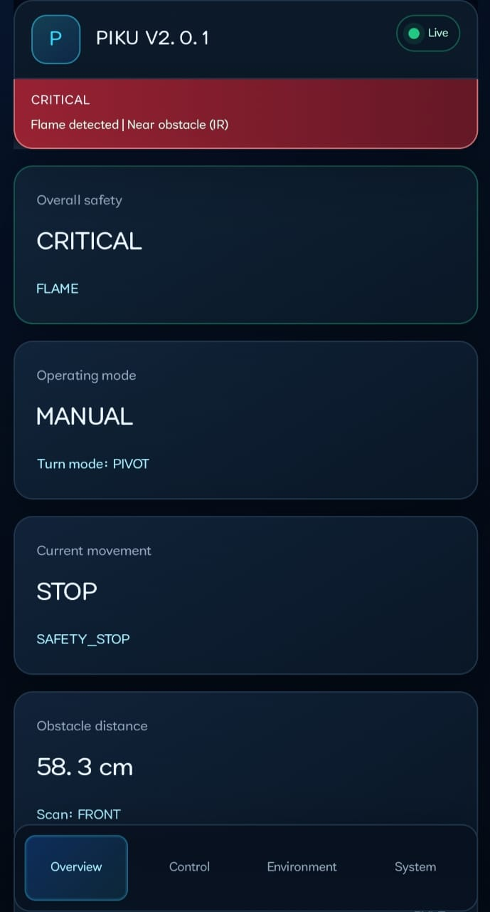
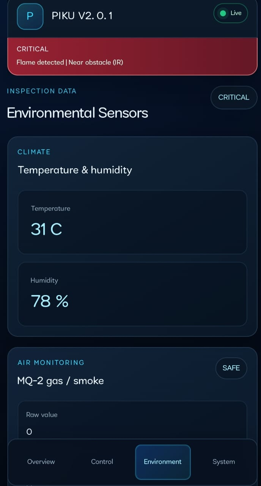
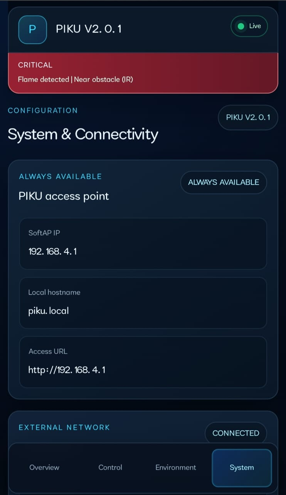

# PIKU V2.0.1 Physical Development

## Hardware Architecture, Testing Evidence, and Cyber-Physical Systems Research Platform

PIKU V2.0.1 is a developing cyber-physical environmental inspection and intelligent-monitoring robotic platform. It combines a mobile physical system with embedded sensing, local networking, live telemetry, operator control, autonomous behavior, and safety-oriented feedback. This repository documents the physical prototype and the evidence available for its integrated operation; it is not a commercial-product claim or a firmware distribution.

*Figure 1. The integrated PIKU V2.0.1 prototype, showing the four-wheel platform, controller, power electronics, environmental sensors, display, and servo-mounted ultrasonic head.*

## Project overview

PIKU V2.0.1 is an intermediate research prototype connecting:

- a **physical system** of chassis, motors, power electronics, sensors, display, buzzer, servo, and embedded controller;
- a **cyber system** of modular control, live telemetry, a locally served dashboard, manual/autonomous modes, hazard reporting, and radar visualization; and
- a **research direction** toward richer localization, distributed sensing, Edge AI, mapping, ROS 2, higher-level computing, and networked cyber-physical systems.

The repository deliberately separates [implemented and physically tested capabilities](docs/TESTING_AND_VALIDATION.md), [current limitations](docs/LIMITATIONS_AND_FUTURE_WORK.md), and planned research. Future items are not presented as features of V2.0.1.

## Why PIKU V2.0.1 was developed

The platform was developed to move beyond a basic obstacle-avoidance vehicle and establish a reusable experimental base for embedded robotics research. The engineering focus is the integration of mobility, directional ranging, environmental sensing, hazard indication, human-machine interaction, and local wireless communication within one compact mobile prototype.

## Research vision

PIKU provides a practical loop for studying how computation and communication influence a physical robot operating in a changing environment:

> environment → sensing → embedded processing → dashboard/alarm reporting → manual or autonomous decision → motor/servo action → new environmental feedback

V2.0.1 is the tested present platform. Edge AI, compass-assisted navigation, encoder feedback, odometry, mapping, Raspberry Pi-class computing, ROS 2, and multi-robot coordination remain planned research directions. See the [CPS research vision](docs/CPS_RESEARCH_VISION.md).

## System overview

| Layer | Implemented in V2.0.1 |
|---|---|
| Physical mobility | Four-wheel chassis, four DC gear motors, L298N driver |
| Embedded control | ESP32 DevKit V1 |
| Ranging and inspection | HC-SR04 on an SG90 servo; front/left/right focused inspection |
| Environmental sensing | DHT22, MQ-2 analog gas/smoke sensing, flame and front IR sensing |
| Local feedback | ST7789 1.3-inch TFT and active buzzer |
| Networking | Direct SoftAP and configured local-router/Home Wi-Fi operation |
| Human interface | Mobile-friendly local web dashboard |
| Operating modes | Manual directional control and autonomous operation |

*Figure 2. Top view of the mobile power, motor-drive, regulation, controller, and sensor assembly.*

## Physical architecture

The 3S 18650 power system feeds the motor branch and an LM2596-regulated 5 V electronics branch. The ESP32 coordinates motor-direction signals, sensor acquisition, ultrasonic-head position, display output, buzzer behavior, and local networking. Grounds are common, while appropriate level protection is required for any signal that can exceed ESP32 GPIO limits.

*Figure 3. Prototype power and system connection diagram. It is engineering documentation, not a certified industrial schematic; wiring and voltage levels must be independently checked before energizing the system.*

Detailed subsystem and verified GPIO information is provided in [Hardware Architecture](docs/HARDWARE_ARCHITECTURE.md).

## Hardware components

The current evidence supports the following V2.0.1 hardware:

- ESP32 DevKit V1
- four-wheel mobile chassis and four DC gear motors
- L298N dual H-bridge motor driver
- 3S 18650 battery arrangement with charging/protection hardware
- LM2596 buck regulation
- HC-SR04 ultrasonic sensor and SG90 servo
- DHT22 temperature/humidity sensor
- MQ-2 gas/smoke module using analog output
- flame sensor and front IR obstacle sensor
- ST7789 1.3-inch TFT
- active buzzer
- switches, connectors, voltage protection, wiring, and mounting hardware

Commercial modules are integrated into the research platform; the project does not claim invention of the individual modules.

## Sensing and monitoring capabilities

The prototype combines directional distance measurement with temperature, humidity, raw gas/smoke response, flame indication, and front IR obstacle indication. Sensor state is exposed through the TFT, buzzer/alarm behavior, and dashboard. The MQ-2 response requires environment-specific calibration, and none of the sensor readings are certified metrology or life-safety data.

## Manual and autonomous operation

Manual mode provides forward, reverse, left, right, and stop commands through the local dashboard. Auto mode uses available obstacle information and timed directional maneuvers to support autonomous movement. Motion is open-loop: V2.0.1 has no wheel encoders, heading feedback, closed-loop speed control, or calibrated PWM speed regulation.

## Ultrasonic radar and focused inspection

The HC-SR04 is mounted on a servo so the sensing direction can change without rotating the entire chassis. The documented interface supports live radar visualization and deliberate LEFT / FRONT / RIGHT inspection. Direction-aware proximity feedback connects physical sensor orientation to the operator interface and warning behavior.

*Figure 4. Mobile dashboard control area with movement commands and live directional radar visualization during a critical alarm state.*

## Communication architecture

The dashboard is served locally by the embedded system; it is not a cloud-control interface.

- **Direct SoftAP:** a nearby client connects to the robot's access point and reaches the local interface.
- **Home Wi-Fi:** the robot joins a configured local router network for access within the tested local environment.

Range varies with walls, interference, antenna orientation, client hardware, and router conditions. Observations in this repository are prototype results, not certified wireless specifications.

## Dashboard interface

The available screenshots document four interface areas:

| Area | Visible purpose |
|---|---|
| Overview | Overall safety, operating mode, movement, distance, and scan direction |
| Control | Manual movement controls and live ultrasonic radar |
| Environment | Temperature, humidity, MQ-2 response, and hazard status |
| System | SoftAP/local connectivity information and external-network state |

  
  
  
  

*Figure 5. The four documented mobile-dashboard areas. Displayed sensor values are observations from the captured prototype state, not calibrated specifications.*

## Engineering contribution

The main contribution is system-level engineering: embedded architecture, physical realization, subsystem integration, human-machine interface design, iterative testing, and development of a foundation for later CPS research. Directional ultrasonic inspection, multi-sensor hazard awareness, local browser feedback, dual local-network modes, and coordinated physical feedback turn the platform into more than a simple mobile robot. See [Engineering Contribution](docs/ENGINEERING_CONTRIBUTION.md).

## Physical testing and observed results

The documented final integrated test session lasted approximately 30 minutes. Under the tested conditions, manual and autonomous movement, servo scanning, focused inspection, radar direction, environmental telemetry, directional alarms, buzzer, TFT, SoftAP access, and Home Wi-Fi access remained operational. This is described as an observed prototype result, not as a percentage success rate or a reliability certification.

See [Testing and Validation](docs/TESTING_AND_VALIDATION.md) for the evidence boundaries and cautious network-range observations.

## Design limitations

PIKU V2.0.1 uses directional motor commands and timed/open-loop maneuvers. It has no PWM speed regulation in this version, rear obstacle sensor, encoders, compass, odometry, SLAM, camera perception, or onboard Edge AI. Its wiring and mechanical structure remain prototype-grade. The full limitation record is in [Limitations and Future Work](docs/LIMITATIONS_AND_FUTURE_WORK.md).

## Connection to long-term CPS research

The present platform establishes a physical/cyber feedback loop suitable for incremental research. Planned stages may add calibrated motion control, heading and encoder feedback, stronger power management, richer perception, mission logging, localization/mapping, Edge AI, ROS 2, Raspberry Pi-class computing, fleet monitoring, and multi-robot coordination. These are roadmap items, not V2.0.1 capabilities.

## Repository contents

| Path | Contents |
|---|---|
| `docs/HARDWARE_ARCHITECTURE.md` | Subsystems, power structure, and verified GPIO mapping |
| `docs/ENGINEERING_CONTRIBUTION.md` | System-integration and research-platform contribution |
| `docs/TESTING_AND_VALIDATION.md` | Observed test evidence, boundaries, and cautious claims |
| `docs/CPS_RESEARCH_VISION.md` | Current CPS loop and staged future direction |
| `docs/LIMITATIONS_AND_FUTURE_WORK.md` | Present limitations and planned work |
| `docs/SAFETY_AND_WIRING_NOTES.md` | Electrical, mechanical, and sensing safety notes |
| `docs/EVIDENCE_INVENTORY.md` | Publication classification and figure provenance |
| `figures/` | Sanitized, professionally named physical-development evidence |

## Firmware availability

Firmware source is maintained separately in a private repository and may be made available for authorized academic or technical review.

No firmware source, firmware binaries, PlatformIO project files, credentials, or private dashboard source assets are included here.

## Researcher Information

**Md Habibur Rahman Habib**  
EEE Undergraduate Student  
Research Assistant  
Project Lead and Lead Developer — PIKU Robotics Platform

This work forms part of continuing research in robotics, embedded systems,
intelligent monitoring, and cyber-physical systems.

## Responsible-use and safety note

This is a supervised research prototype. Verify polarity, voltage levels, common grounding, motor isolation, battery condition, and HC-SR04 ECHO level protection before use. Keep hands clear of moving parts. Gas, smoke, and flame indications are prototype warning functions and must never replace certified fire or gas detectors. Read [Safety and Wiring Notes](docs/SAFETY_AND_WIRING_NOTES.md) before reproducing or operating any described arrangement.
