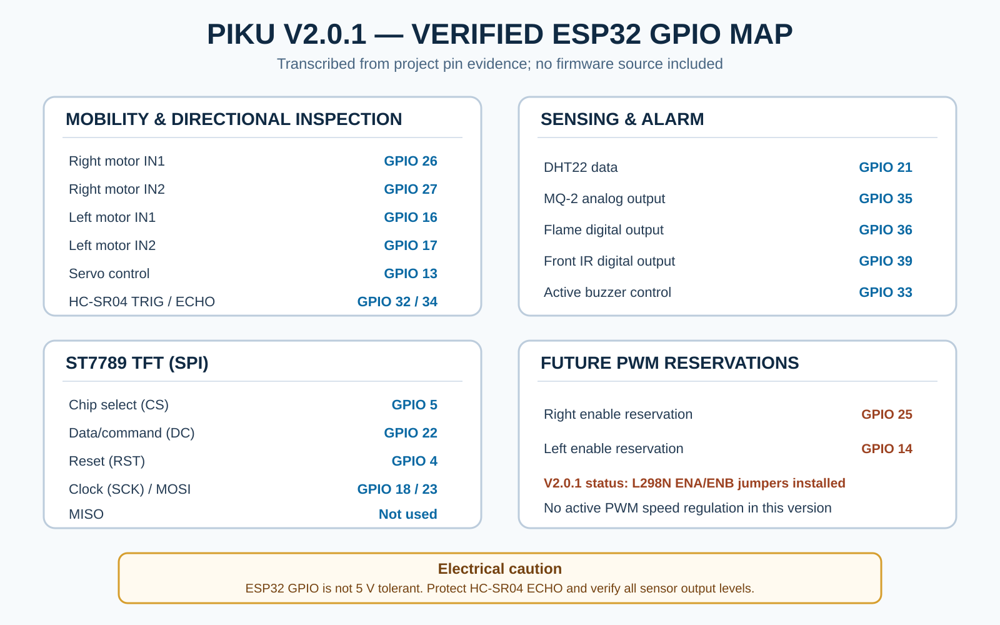

# Hardware Architecture

## Architecture basis

This description is limited to the current PIKU V2.0.1 evidence: physical photographs, the power/system connection diagram, the verified GPIO source image, and documented prototype behavior. It does not reproduce firmware implementation.

*Figure 1. Documentation-only GPIO map transcribed from the verified pin evidence. GPIO 25 and GPIO 14 are reserved for future motor-enable PWM; the present motor-driver enable jumpers remain installed.*

## Controller

An ESP32 DevKit V1 is the primary embedded controller. It coordinates motor direction, sensor inputs, servo direction, TFT output, buzzer behavior, local telemetry, and locally served dashboard access.

## Power system

The documented prototype uses:

- a 3S 18650 battery arrangement (11.1 V nominal and 12.6 V when fully charged);
- a charging/protection module appropriate to the documented 3S arrangement;
- a main power switch;
- a switched battery rail for the L298N motor driver;
- an LM2596 buck converter adjusted to a regulated 5.0 V electronics bus; and
- a common ground between power, controller, driver, sensors, display, servo, and buzzer.

The circuit diagram is prototype documentation. Battery configuration, charger compatibility, polarity, regulator output, conductor capacity, and each module's actual voltage requirement must be independently verified before connection.

*Figure 2. Documented power distribution, common ground, motor branch, regulated electronics branch, and high-level peripheral connections.*

## Motor system

An L298N dual H-bridge drives left and right pairs of DC gear motors on a four-wheel chassis. Four ESP32 outputs provide directional control. The current hardware evidence shows the L298N ENA/ENB jumper caps installed.

GPIO 25 and GPIO 14 are reserved for future right/left enable PWM respectively; they are not active speed-control signals in V2.0.1. Present movement uses directional commands and timed/open-loop maneuvers, without encoder feedback or calibrated speed regulation.

## Sensing system

- **HC-SR04:** directional ultrasonic ranging on a servo-mounted head
- **DHT22:** temperature and humidity
- **MQ-2:** analog gas/smoke response to an ESP32 ADC input
- **Flame sensor:** digital hazard indication
- **Front IR sensor:** digital near-obstacle indication

The MQ-2 requires warm-up and environment-specific calibration. Analog and digital sensor outputs must remain within ESP32 input limits. The sensing stack is intended for supervised prototype monitoring, not certified measurement or life-safety use.

## Servo-mounted ultrasonic mechanism

An SG90 servo changes the direction of the HC-SR04 sensing head. The documented system uses the mechanism for automatic scanning and manual LEFT / FRONT / RIGHT inspection. The resulting direction and distance state is represented on the dashboard radar and contributes to proximity warning behavior.

## Display and alarm output

The ST7789 1.3-inch TFT uses SPI signals for local status feedback. An active buzzer provides physical warning output. These outputs complement, rather than replace, the dashboard.

## Communication

The ESP32 serves a local web dashboard through:

- its direct SoftAP network; and
- a configured local router/Home Wi-Fi network.

The architecture does not claim cloud control. Wireless range is dependent on the test environment.

## Verified GPIO assignment

| Subsystem | Signal | ESP32 GPIO | Evidence note |
|---|---|---:|---|
| TFT | CS | 5 | Verified in pin evidence |
| TFT | DC | 22 | Verified in pin evidence |
| TFT | RST | 4 | Verified in pin evidence |
| TFT | SCK | 18 | Verified in pin evidence |
| TFT | MOSI | 23 | Verified in pin evidence |
| TFT | MISO | Not used | Recorded as disabled in pin evidence |
| Right motor pair | IN1 | 26 | Verified in pin evidence |
| Right motor pair | IN2 | 27 | Verified in pin evidence |
| Left motor pair | IN1 | 16 | Verified in pin evidence |
| Left motor pair | IN2 | 17 | Verified in pin evidence |
| Servo | Control | 13 | Verified in pin evidence |
| HC-SR04 | TRIG | 32 | Verified in pin evidence |
| HC-SR04 | ECHO | 34 | Verified in pin evidence; input-only GPIO |
| DHT22 | Data | 21 | Verified in pin evidence |
| MQ-2 | Analog output | 35 | Verified in pin evidence; input-only ADC GPIO |
| Active buzzer | Control | 33 | Verified in pin evidence |
| Flame sensor | Digital output | 36 | Verified in pin evidence; input-only GPIO |
| Front IR sensor | Digital output | 39 | Verified in pin evidence; input-only GPIO |
| L298N right enable | Future PWM reservation | 25 | Reserved; current ENA jumper installed |
| L298N left enable | Future PWM reservation | 14 | Reserved; current ENB jumper installed |

## Electrical cautions

- ESP32 GPIO is not 5 V tolerant.
- The HC-SR04 ECHO signal requires correct level protection before GPIO 34.
- Verify that MQ-2 AO never exceeds the ADC input range.
- Check flame/IR module output levels and add level shifting where required.
- Keep all grounds common as documented.
- Verify power wiring separately from signal wiring.
- Treat the diagram as prototype documentation, not a certified industrial schematic.

See [Safety and Wiring Notes](SAFETY_AND_WIRING_NOTES.md) before construction or operation.
