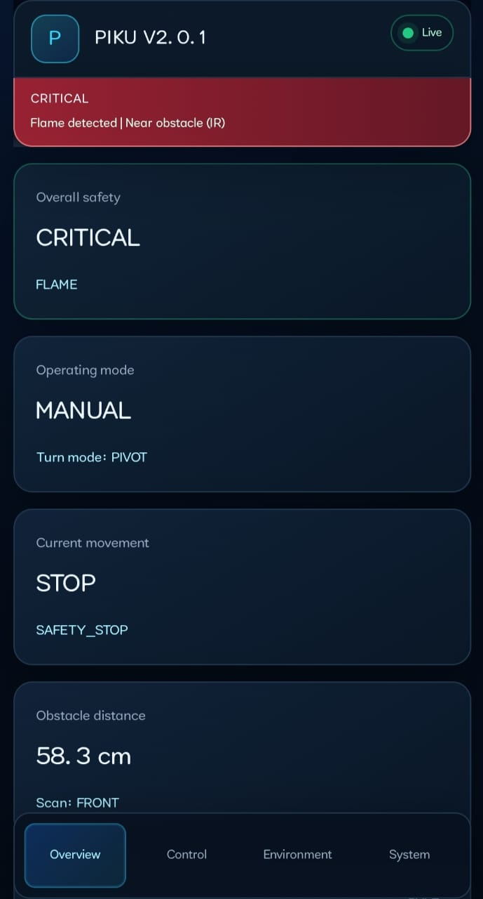
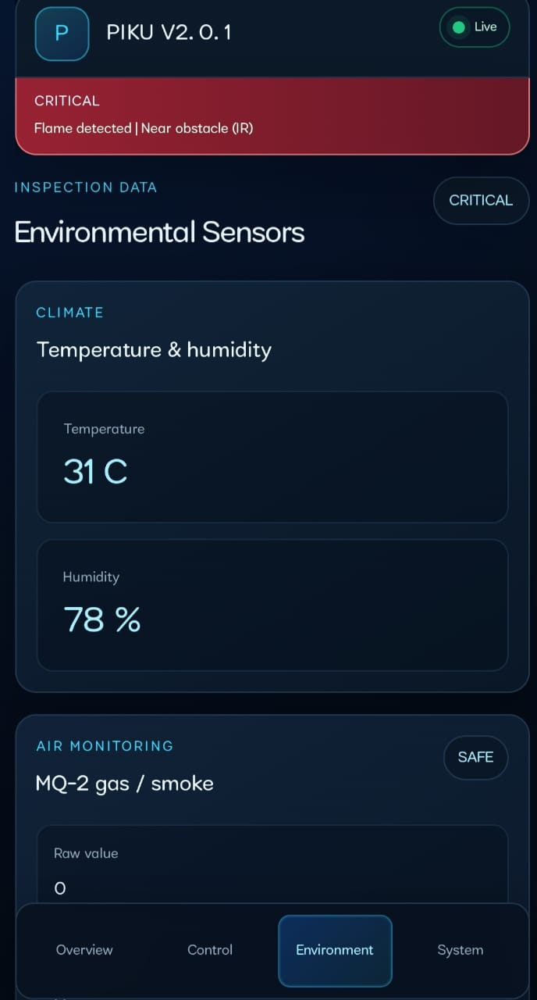

# Testing and Validation

## Evidence standard

This document distinguishes the supplied final-test record from calibrated measurement and formal validation. “Observed” means reported for the documented prototype under the tested conditions. It does not imply certification, statistical reliability, or guaranteed performance in another environment.

The repository contains physical photographs, architecture figures, GPIO evidence, and captured dashboard states. It does not contain raw sensor logs, repeated-trial datasets, oscilloscope traces, certified instruments, or a formal test-laboratory report. No authentic screenshot of the final 300 cm radar state was found in the preserved local archive.

## Evidence epoch A — earlier integrated test session

The integrated prototype completed an earlier documented approximately 30-minute ground-test session, with the tested mobility, sensing, dashboard, alarm, display, and communication functions remaining operational under the tested conditions.

No percentage success rate is stated because the evidence does not define a repeated trial count and failure count.

## Observed prototype checks

| Area | Documented observation | Evidence boundary |
|---|---|---|
| Manual mobility | Forward, reverse, left, right, and stop behavior operated in Manual mode | Qualitative integrated test observation |
| Autonomous mobility | Auto mode operated during physical testing | No formal route-completion or avoidance-rate metric |
| Ultrasonic scan | Servo-mounted scan operated | No calibrated angular or distance-accuracy study |
| Focused inspection | LEFT / FRONT / RIGHT inspection operated | Directional function observation |
| Radar | Displayed direction agreed with sensor-head direction | Qualitative agreement, not angular calibration |
| Proximity alarm | Continuous directional proximity warning behavior operated | No formal alarm-latency distribution |
| Environmental telemetry | Temperature, humidity, gas/smoke response, flame, and IR states were presented | Values are not certified metrology data |
| Buzzer | Physical warning output operated | Qualitative output check |
| TFT | Local display operated | Functional observation |
| SoftAP | Direct local dashboard access operated | Prototype wireless observation |
| Home Wi-Fi | Dashboard access through the tested local router environment operated | Environment- and router-dependent |
| Integrated endurance | Robot remained operational for the approximately 30-minute session | One documented session; not a lifetime or reliability test |
| Tested software lineage | The then-current Advanced competition firmware lineage was used for the reported session | No commit or binary hash was preserved with this historical session |

## Evidence epoch B — corrective software and build work

Later firmware corrections established Manual command timeout behavior, Auto STOP/mode interruption, corrected LEFT / FRONT / RIGHT radar orientation, revised ultrasonic out-of-range handling, and the 300 cm radar visualization. Clean-build verification confirmed that the final software baseline was buildable, but build verification was not itself a physical test.

The final documentation-only firmware cross-reference is `dd2e951089d6e18f8c0b49de785144f646876d81`. Firmware source and credentials remain outside this public repository.

## Evidence epoch C — final corrective physical validation

User-reported prototype testing after the final ultrasonic/radar corrections recorded the following qualitative results:

| Check | Observed result | Evidence boundary |
|---|---|---|
| Open-space/no-echo driving | PASS | Prototype observation; not a sensor-health or fail-safe claim |
| Manual Forward behavior | PASS | Qualitative functional check |
| Auto operation | PASS | No route-completion or avoidance-rate metric |
| Nearby obstacle after prior no-echo | PASS | Subsequent positive obstacle evidence was detected |
| Nearby obstacle response | PASS | Existing response remained operational; latency was not measured |
| 300 cm radar visualization | PASS | Functional display observation; no final screenshot was preserved locally |
| LEFT / FRONT / RIGHT behavior | PASS | Qualitative direction check; no angular calibration |
| Normal prototype operation | No observed regression | Limited reported session, not statistical reliability evidence |

The installed HC-SR04 also displayed approximately **341.5 cm** during prototype testing. This value is preserved as an observed, uncalibrated reading; it is not evidence of certified range or measurement accuracy.

The final radar uses a 300 cm outer display range with 75 / 150 / 225 / 300 cm rings. Valid values above 300 cm may remain numerically visible while their graphical position is capped at the 300 cm boundary. Ordinary open-space/no-return/out-of-range results are intentionally non-blocking. HC-SR04 and IR sampling continue, and subsequent positive nearby-obstacle evidence remains actionable.

## Dashboard evidence

*Figure 1. Historical/pre-final captured Overview state showing live connection, critical hazard indication, Manual mode, stopped/safety-stop state, distance, and front scan direction.*

*Figure 2. Historical/pre-final captured Environment state showing temperature, humidity, MQ-2 raw response, and hazard status. Values illustrate a test state and are not calibration references.*

## Network observations

The supplied project record describes:

- direct SoftAP control observed approximately within 15–25 feet; and
- Home Wi-Fi control observed approximately within 50–70 feet or across the tested home environment.

These are approximate observations under the tested conditions. They are not certified communication specifications and should not be generalized to different walls, interference, antennas, routers, clients, or power conditions.

## Measured and displayed values

The dashboard figures visibly include example state values such as 58.3 cm range, 31 °C temperature, and 78% relative humidity. They are preserved as captured interface evidence only. The repository does not claim the values were established with traceable calibrated instruments.

## Claims not established

The available evidence does not establish:

- a statistical success percentage;
- calibrated sensor accuracy;
- motor-speed precision;
- communication performance beyond the observed environment;
- industrial reliability or ingress protection;
- battery endurance beyond the documented session;
- safety certification;
- autonomous navigation coverage; or
- operation of future AI, localization, mapping, camera, ROS 2, or fleet features.

The evidence also does not establish that ordinary no-echo proves an electrically healthy ultrasonic path. The non-blocking policy is an intentional operating decision for supervised prototype use.

## Recommended future validation

Future work should use defined test protocols with trial counts, pass/fail criteria, timestamped logs, reference instruments, power measurements, controlled obstacle layouts, network signal measurements, and repeatable environmental conditions. Such work would allow quantitative claims without overstating the current evidence.
